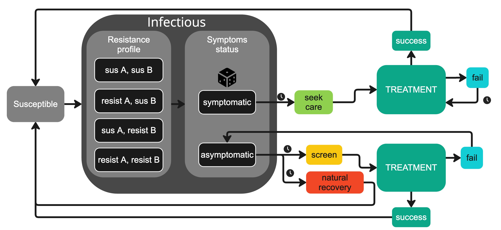

This is an R Markdown document for easy access to and recreation of the figures
for the manuscript "Measuring the health benefits, costs, and cost-effectiveness of antimicrobial-resistant gonorrhea surveillance in the United States", currently in revision at *Lancet Public Health Americas.*


```{r setup1, include=FALSE}
# This chunk has the most basic setup functions

library(ggplot2)
library(tidyverse)
library(data.table)
library(RColorBrewer)
library(egg)
library(epiR)
library(patchwork)
library(knitr)

multiplot <- function(..., plotlist=NULL, file, cols=1, layout=NULL) {
  library(grid)
  
  # Make a list from the ... arguments and plotlist
  plots <- c(list(...), plotlist)
  
  numPlots = length(plots)
  
  # If layout is NULL, then use 'cols' to determine layout
  if (is.null(layout)) {
    # Make the panel
    # ncol: Number of columns of plots
    # nrow: Number of rows needed, calculated from # of cols
    layout <- matrix(seq(1, cols * ceiling(numPlots/cols)),
                     ncol = cols, nrow = ceiling(numPlots/cols))
  }
  
  if (numPlots==1) {
    print(plots[[1]])
    
  } else {
    # Set up the page
    grid.newpage()
    pushViewport(viewport(layout = grid.layout(nrow(layout), ncol(layout))))
    
    # Make each plot, in the correct location
    for (i in 1:numPlots) {
      # Get the i,j matrix positions of the regions that contain this subplot
      matchidx <- as.data.frame(which(layout == i, arr.ind = TRUE))
      
      print(plots[[i]], vp = viewport(layout.pos.row = matchidx$row,
                                      layout.pos.col = matchidx$col))
    }
  }
}
my_theme = theme_bw(base_size = 8)


load("allFigureData.RData")

knitr::opts_chunk$set(warning = FALSE, message = FALSE) 

```

```{r setup2, include = FALSE}
#This chunk has the basic analysis functions needed

identify = function(df, resampledf){
  df$uniqueID <- paste(as.character(df$yearX), as.character(df$RunNumber), as.character(df$seed), sep='')
  
  
  
  dfrowcount <- matrix(nrow = 1, ncol = 2)
  for (i in unique(df$seed)){
    newrow <- c(i,count(df[df$seed == i,]))
    dfrowcount <- rbind(dfrowcount, newrow)
    
    
  }
  
  dfrowcount[,2] <- as.integer(dfrowcount[,2])
  duplicates <- dfrowcount[dfrowcount[,2]>31,1][-1]
  duplicate.seeds <- unlist(duplicates, use.names=FALSE)
  
  df <- df[!df$seed %in% duplicate.seeds,]

  
  df$resampled <- rep(0, length(df[,1]))
  for (i in df$seed){
    df$resampled[df$seed==i] <- sum(resampledf$seed==i)
  }
  
  df$Incidence <- as.integer(df$Incidence)
  
  return(df)
}

get_ends = function(df){
  ends <- data.frame()
  
  runs <- unique(df$uniqueID)
  
  for (i in runs){
    thisRunData <- df %>% filter(uniqueID == i)
    
    thisRunLastRow <- thisRunData %>% filter(tick == max(tick))
    ends <- rbind(ends, thisRunLastRow)
  }
  
  
  return(ends)
}


prev_binom_likelihood = function(x){
  return(dbinom(93, 2075, x / 100, log=TRUE)) # values from https://pubmed.ncbi.nlm.nih.gov/30973847/
}

inc_norm_likelihood = function(x){
  return(dnorm(6508, x, x/5, log=TRUE)) # values from 2018 CDC report
}

sympt_binom_likelihood = function(x){
  return(dbinom(233, 343, x, log=TRUE))
}

#calculates the likelihoods and returns the df with weights for the ends
calc_weights = function(df){
  #target_data <- df %>% filter(tick %% 52 == 0)
  target_data <- df %>% filter(tick > 261) #years 6, 7, 8, 9, 10
  
  data_ends_loc <- target_data %>% filter(tick == 10 * 52)
  
  #target_data = cbind(likelihood_prev = 0, likelihood_detect = 0, likelihood_sympt = 0, combined_log_likelihood = 0, target_data)
  
  #calc likelihood for each target for each year for each trajectory
  target_data$likelihood_prev = prev_binom_likelihood(target_data$Prevalence)
  target_data$likelihood_detect = inc_norm_likelihood(target_data$Detected)
  target_data$likelihood_sympt = sympt_binom_likelihood(target_data$DetectedAndSymptoms/target_data$Detected)
  
  #combine targets for a year for a trajectory
  target_data$combined_log_likelihood <- target_data$likelihood_prev + target_data$likelihood_detect + target_data$likelihood_sympt
  
  #sum across trajectory
  for (i in 1:nrow(data_ends_loc)){
    thisrun <- data_ends_loc$uniqueID[i]
    data_ends_loc$combined_log_likelihood[i] <- sum(target_data$combined_log_likelihood[target_data$uniqueID == thisrun]) #sum likelihoods across this trajectory
  }
  
  #subtract from max
  data_ends_loc$stable_combined_log_likelihood <- data_ends_loc$combined_log_likelihood - max(data_ends_loc$combined_log_likelihood)
  
  data_ends_loc$weight = exp(data_ends_loc$stable_combined_log_likelihood)
  
  sum_likelihood = sum(data_ends_loc$weight)
  
  

  
  return(data_ends_loc)
}

#takes the df with weights and returns the best n values
best_ends = function(df, n){
  df <- df[order(df$combined_log_likelihood, decreasing = TRUE),]
  best_of_sweep <- df[1:n,]
  return(best_of_sweep)
}

#takes data ends and matches to full trajectories (to visualize best n trajectories)
best_traj = function(full_df, best_df){
  new_df <- full_df %>% filter(uniqueID %in% best_df$uniqueID)
  return(new_df)
}

#takes the df with weights and resamples with replacement
resample = function(df, n){
  combinedResample<-df[sample(nrow(df), size = n, prob = (df$weight), replace = TRUE),]
  return(combinedResample)
}


```


# Figure 1


# Figure 2
```{r setupFigure2, include = FALSE}
# This chunk contains functions for the calibration figure (Figure 2).
visualize_calibration_MSM = function(dfcalibrated){
  multiplot(
    viz_prev_MSM_cal(dfcalibrated, "A."),
    viz_incMSM_cal(dfcalibrated, "B."),
    viz_sympt_MSM_cal(dfcalibrated, "C."),
    cols = 3)
}

viz_prev_MSM_cal = function(df, title){
  df <- df %>% filter(tick >= 260)
  prev <- ggplot(data = df, aes(x = (tick / 52)-5, group = uniqueID)) + 
    geom_line(aes(y = Prevalence, alpha = resampled),linewidth = 0.05, color = "black") +
    geom_point(aes(y=4.5, x = 1), color="red", size = 1) +
    geom_errorbar(aes(ymin = 3.6, ymax = 5.4, x = 1), color = "red", size=0.25)+
    geom_point(aes(y=4.5, x = 2), color="red", size = 1) +
    geom_errorbar(aes(ymin = 3.6, ymax = 5.4, x = 2), color = "red", size=0.25)+
    geom_point(aes(y=4.5, x = 3), color="red", size = 1) +
    geom_errorbar(aes(ymin = 3.6, ymax = 5.4, x = 3), color = "red", size=0.25)+
    geom_point(aes(y=4.5, x = 4), color="red", size = 1) +
    geom_errorbar(aes(ymin = 3.6, ymax = 5.4, x = 4), color = "red", size=0.25)+
    geom_point(aes(y=4.5, x = 5), color="red", size = 1) +
    geom_errorbar(aes(ymin = 3.6, ymax = 5.4, x = 5), color = "red", size=0.25)+
    labs(title = title,
         x = "Year",
         y = "Prevalence (%) in MSM") +
    theme(plot.title = element_text(size=8)) +
    #geom_vline(xintercept=yearX, linetype="dashed")+
    coord_cartesian(ylim=c(0,10), xlim=c(0, 25))+
    my_theme+
    theme(legend.position = "none") +
    scale_alpha(range=c(0.25, 1))+
    annotate("rect", xmin = 0, xmax=5, ymin=-Inf, ymax=Inf, alpha = 0.25)
  return(prev)
}

viz_incMSM_cal = function(df, title){
  df <- df %>% filter(tick >= 260)
  inc <- ggplot(data = df, aes(x = (tick / 52)-5, y = 100000 * (Detected / 100000), group = uniqueID)) + 
    geom_line( aes(y = 100000 * (Detected / 100000), alpha=resampled),size = 0.05, color="black") +
    geom_point(aes(y=6508, x = 1), color="red", size = 1) +
    geom_errorbar(aes(ymin = 5206, ymax = 7809, x = 1), color = "red", size=0.25)+
    geom_point(aes(y=6508, x = 2), color="red", size = 1) +
    geom_errorbar(aes(ymin = 5206, ymax = 7809, x =2), color = "red", size=0.25)+
    geom_point(aes(y=6508, x = 3), color="red", size = 1) +
    geom_errorbar(aes(ymin = 5206, ymax = 7809,x = 3), color = "red", size=0.25)+
    geom_point(aes(y=6508, x = 4), color="red", size = 1) +
    geom_errorbar(aes(ymin = 5206, ymax = 7809, x = 4), color = "red", size=0.25)+
    geom_point(aes(y=6508, x = 5), color="red", size = 1) +
    geom_errorbar(aes(ymin = 5206, ymax = 7809, x = 5), color = "red", size=0.25)+
    labs(title = title,
         x = "Year",
         y = "Cases Detected per 100,000 MSM")+
    theme(plot.title = element_text(size=8)) +
    coord_cartesian(ylim= c(0,20000),xlim=c(0,25))+
    my_theme+
    theme(legend.position = "none")+
    scale_alpha(range=c(0.25, 1))+
    annotate("rect", xmin = 0, xmax=5, ymin=-Inf, ymax=Inf, alpha = 0.25)
  return(inc)
}

viz_sympt_MSM_cal = function(df, title){
  df <- df %>% filter(tick >= 260)
  symptomatic <- ggplot(data = df, aes(x = (tick / 52)-5, y = DetectedAndSymptoms / Detected, group = uniqueID)) + 
    geom_line( aes(y = DetectedAndSymptoms / Detected, alpha=resampled),size = 0.05, color="black") +
    geom_point(aes(y=0.679, x = 1), color="red", size = 1) +
    geom_errorbar(aes(ymin = 0.628, ymax = 0.7265, x = 1), color = "red", size=0.25)+
    geom_point(aes(y=0.679, x = 2), color="red", size = 1) +
    geom_errorbar(aes(ymin = 0.628, ymax = 0.7265, x = 2), color = "red", size=0.25)+
    geom_point(aes(y=0.679, x = 3), color="red", size = 1) +
    geom_errorbar(aes(ymin = 0.628, ymax = 0.7265,x = 3), color = "red", size=0.25)+
    geom_point(aes(y=0.679, x = 4), color="red", size = 1) +
    geom_errorbar(aes(ymin = 0.628, ymax = 0.7265, x = 4), color = "red", size=0.25)+
    geom_point(aes(y=0.679, x = 5), color="red", size = 1) +
    geom_errorbar(aes(ymin = 0.628, ymax = 0.7265, x = 5), color = "red", size=0.25)+
    labs(x = "Year",
         y = "Prop. Detected Cases with Symptoms", 
         title = title) +
    coord_cartesian(ylim= c(0.5, 1.0),xlim=c(0,25))+
   # scale_y_continuous(limits = c(0.0, 1.0), labels = c(0.0, 0.1, 0.2, 0.3, 0.4, 0.5, 0.6, 0.7, 0.8, 0.9, 1.0)) + #ylim(0.4, 0.9) +
    my_theme +
    theme(legend.position = "none")+
    scale_alpha(range=c(0.25, 1))+
    annotate("rect", xmin = 0, xmax=5, ymin=-Inf, ymax=Inf, alpha = 0.25)
  
  return(symptomatic)
}

```

```{r figure2, echo = FALSE, fig.width=8, fig.height=3}
visualize_calibration_MSM(dfcalibrated)
```

# Figure 3

```{r setupFigure3, include = FALSE}
summary_plot_noDST = function(df1, df2, df3, df4){ 
  df1ends <- cumulative_everything(df1)
  df2ends <- cumulative_everything(df2)
  df3ends <- cumulative_everything(df3)
  df4ends <- cumulative_everything(df4)

  
  allends <- rbind(df1ends,
                   df2ends,
                   df3ends, 
                   df4ends
                   )
  
  
  counter_levels <- c("realistic_combo_50_50_00", "test-of-cure_80", "random", "GISP")
  counter_labels <- c("Combo", "TOC", "RT", "GISP")
  
  inc <- ggplot(data = allends, aes(x=cumulativeInc/1000, y = factor(counterfactual, levels = counter_levels))) +
    # geom_point() +
    stat_summary(fun = mean, fun.min = function(a) {quantile(a, 0.025)}, fun.max = function(a){quantile(a, 0.975)})+
    labs(
      title = "A.",
      y = "",
      x="Cumulative incidence over 20 years\nper 100,000 (thousands)"
    )+
    my_theme +
    scale_y_discrete(labels=counter_labels)+
    coord_cartesian(xlim=c(0, 1500))
  
  failure <- ggplot(data = allends, aes(x=cumulativeFailure * 100, y = factor(counterfactual, levels = counter_levels))) +
    stat_summary(fun = mean, fun.min = function(a) {quantile(a, 0.025)}, fun.max = function(a){quantile(a, 0.975)})+
    labs(
      title = "B.",
      y = "",
      x="% failures per treatment attempt\ncumulative over 20 years"
    )+
    my_theme +
    scale_y_discrete(labels=counter_labels) +
    coord_cartesian(xlim=c(0, 50))
  
  x <- ggplot(data = allends, aes(x=cumulativeE, y = factor(counterfactual, levels = counter_levels))) +
    stat_summary(fun = mean, fun.min = function(a) {quantile(a, 0.025)}, fun.max = function(a){quantile(a, 0.975)})+
    labs(
      title = "C.",
      y = "",
      x="Cumulative treatments with ertapenem\nper 100,000 over 20 years"
    )+
    my_theme +
    scale_y_discrete(labels=counter_labels)+
    coord_cartesian(xlim=c(0, 50000))
  
  
  summary <- ggarrange(inc +
                         theme(axis.text.y = element_text(size = 8),axis.text.x = element_text(size = 8),axis.title.x = element_text(size = 8)), failure + 
                         theme(axis.text.y = element_blank(),
                               axis.ticks.y = element_blank(),
                               axis.title.y = element_blank(),
                               axis.text.x = element_text(size = 8),
                               axis.title.x = element_text(size = 8)), x + 
                         theme(axis.text.y = element_blank(),
                               axis.ticks.y = element_blank(),
                               axis.title.y = element_blank() ,
                               axis.text.x = element_text(size = 8),
                               axis.title.x = element_text(size = 8)), nrow = 1)
  return(summary)
  
  
}

cumulative_everything = function(df){
  #get ends so that can save results from each separate trajectory
  dfends <- get_ends(df)
  
  #exclude burn-in period and calibration period
  df <- df %>% filter(tick > 521) 
  
  dfends$cumulativeCosts <- cumulative_costs(df)
  dfends$cumulativeQALYs <- cumulative_QALYs(df)
  dfends$cumulativeX <- cumulative_X(df)
  dfends$cumulativeInc <- cumulative_inc(df)
  dfends$cumulativeResist <- cumulative_resist(df)
  dfends$cumulativeFailure <- cumulative_failure(df)
  dfends$cumulativeE <- cumulative_E(df)
  dfends$cumulativeMutated <- cumulative_mutated(df)

  #weight with resampled
  newdf <- dfends
  for (traj in row.names(dfends)){
    #how many times does traj appear in resampled df?
    dup <- dfends[traj,]$resampled-1
    
    #add that many duplicate rows to ceadf
    if (dup > 0){
      newdf <- rbind(newdf, dfends[rep(traj,dup),])
    }
  }
  
  return(newdf)
}

cumulative_costs = function(df){
  
  cumulative <- c()
  runs <- unique(df$uniqueID)
  
  for (i in runs){
    thisRunData <- df %>% filter(uniqueID == i)
    thisRunCumulative <- sum(discountedcost(thisRunData))
    cumulative <- c(cumulative, thisRunCumulative)
  }
  
  return(cumulative)
  
}

discountRate <- 0.03

discountedcost = function(df){
  discountedValues <- c()
  i <- df$tick/52
  discountedValues <- c(discountedValues, df$AnnualMonetaryCost/((1+discountRate)^i))
  return(discountedValues)
}

cumulative_QALYs = function(df){
  cumulative <- c()
  runs <- unique(df$uniqueID)
  
  for (i in runs){
    thisRunData <- df %>% filter(uniqueID == i)
    thisRunCumulative <- sum(discountedQALYs(thisRunData))
    cumulative <- c(cumulative, thisRunCumulative)
  }
  
  return(cumulative)
}

discountedQALYs = function(df){
  discountedValues <- c()
  i <- df$tick/52
  discountedValues <- c(discountedValues, df$AnnualQALYsLost/((1+discountRate)^i))
  return(discountedValues)
}


cumulative_X = function(df){
  
  cumulative <- c()
  runs <- unique(df$uniqueID)
  
  for (i in runs){
    thisRunData <- df %>% filter(uniqueID == i)
    thisRunCumulative <- sum(thisRunData$AttemptTreatmentsX)
    cumulative <- c(cumulative, thisRunCumulative)
  }
  
  return(cumulative)
  
}

cumulative_inc = function(df){
  
  cumulative <- c()
  runs <- unique(df$uniqueID)
  
  for (i in runs){
    thisRunData <- df %>% filter(uniqueID == i)
    thisRunCumulative <- sum(thisRunData$Incidence)
    cumulative <- c(cumulative, thisRunCumulative)
  }
  
  return(cumulative)
}

cumulative_resist = function(df){
  
  cumulative <- c()
  runs <- unique(df$uniqueID)
  
  for (i in runs){
    thisRunData <- df %>% filter(uniqueID == i)
    thisRunCumulative <- sum(thisRunData$ResistAIncidence) + sum(thisRunData$ResistBIncidence) + sum(thisRunData$ResistBothIncidence)
    cumulative <- c(cumulative, thisRunCumulative)
  }
  
  return(cumulative)
  
}

sum_failures = function(df){
  failures_A <- sum(discounted_fail_A(df))
  
  failures_B <- sum(discounted_fail_B(df))
  
  failures_X <- sum(discounted_fail_X(df))

  return(failures_A + failures_B + failures_X)
}

discounted_fail_A = function(df){
 # i <- df$tick/52
  fail <- df$AttemptTreatmentsA - df$SuccessTreatmentsA - df$SuccessTreatmentsAandB
  discountedValues <- fail#/((1+discountRate)^i)
  return(discountedValues)
}

discounted_fail_B = function(df){
  #i <- df$tick/52
  fail <- df$AttemptTreatmentsB - df$SuccessTreatmentsB - df$SuccessTreatmentsAandB
  discountedValues <- fail#/((1+discountRate)^i))
  return(discountedValues)
}

discounted_fail_X = function(df){
 # i <- df$tick/52
  fail <- df$AttemptTreatmentsX - df$SuccessTreatmentsX
  discountedValues <- fail#/((1+discountRate)^i))
  return(discountedValues)
}

sum_attempts = function(df){
  attempts_A = sum(df$AttemptTreatmentsA) 
  attempts_B = sum(df$AttemptTreatmentsB)
  attempts_X = sum(df$AttemptTreatmentsX)
  usage_E = sum(df$UsageofErtapenem)
  return(attempts_A + attempts_B + attempts_X + usage_E)
}

cumulative_failure = function(df){
  
  cumulative <- c()
  runs <- unique(df$uniqueID)
  
  for (i in runs){
    thisRunData <- df %>% filter(uniqueID == i)
    
    total_fails <- sum_failures(thisRunData)
    total_attempts <- sum_attempts(thisRunData)
    
    thisRunCumulative <- total_fails/total_attempts
    cumulative <- c(cumulative, thisRunCumulative)
  }
  
  return(cumulative)
  
}

cumulative_E = function(df){
  
  cumulative <- c()
  runs <- unique(df$uniqueID)
  
  for (i in runs){
    thisRunData <- df %>% filter(uniqueID==i)
    thisRunCumulative <- sum(thisRunData$UsageofErtapenem)
    cumulative <- c(cumulative, thisRunCumulative)
  }
  
  return(cumulative)
  
}

cumulative_mutated = function(df){
  cumulative <- c()
  runs <- unique(df$uniqueID)
  
  for (i in runs){
    thisRunData <- df %>% filter(uniqueID==i)
    thisRunCumulative <- sum(thisRunData$DevelopedResistance)
    cumulative <- c(cumulative, thisRunCumulative)
  }
  
  return(cumulative)
}
  


```


```{r figure3, echo = FALSE, fig.width=8, fig.height=3}
summary_plot_noDST(dfGISP25, dfrandom25, dfTOC25, dfreal25)
```

# Figure 4

```{r setupFigure4, include = FALSE}
new_figure_four_noDST = function(df1, df2, df3, df4, yearX){
  a <- viz_inc(df1, "A. GISP", yearX) + theme(axis.title.x = element_blank())
  e<-viz_detected_resist_A(df1, "E.", yearX)+ theme(axis.title.x = element_blank()) 
  i<-viz_detected_resist_B(df1, "I.", yearX)+ theme(axis.title.x = element_blank())
  m<-viz_detected_resist_both(df1, "M.", yearX)+ theme(axis.title.x = element_blank())
  q<-viz_all_failed(df1, "Q.", yearX)+ theme(axis.title.x = element_blank())
  u<-viz_E(df1, "U.", yearX, 9000)
  
  b<- viz_inc(df2, "B. RT", yearX) + theme(axis.title.y = element_blank(), axis.text.y = element_blank(), axis.ticks.y = element_blank(), axis.title.x = element_blank())
  f<-viz_detected_resist_A(df2, "F.", yearX)+ theme(axis.title.y = element_blank(), axis.text.y = element_blank(),  axis.ticks.y = element_blank(),axis.title.x = element_blank())
  j<-viz_detected_resist_B(df2, "J.", yearX)+ theme(axis.title.y = element_blank(), axis.text.y = element_blank(), axis.ticks.y = element_blank(), axis.title.x = element_blank())
  n<-viz_detected_resist_both(df2, "N.", yearX)+ theme(axis.title.y = element_blank(), axis.text.y = element_blank(),  axis.ticks.y = element_blank(),axis.title.x = element_blank())
  r<-viz_all_failed(df2, "R.", yearX)+ theme(axis.title.y = element_blank(), axis.text.y = element_blank(),  axis.ticks.y = element_blank(),axis.title.x = element_blank())
  v<-viz_E(df2, "V.", yearX, 9000)+ theme(axis.title.y = element_blank(),  axis.ticks.y = element_blank(),axis.text.y = element_blank())
  
  
  c<-viz_inc(df3, "C. TOC", yearX)+ theme(axis.title.y = element_blank(),  axis.ticks.y = element_blank(),axis.text.y = element_blank(), axis.title.x = element_blank())
  g<-viz_detected_resist_A(df3, "G.", yearX)+ theme(axis.title.y = element_blank(), axis.ticks.y = element_blank(),axis.text.y = element_blank(), axis.title.x = element_blank())
  k<-viz_detected_resist_B(df3, "K.", yearX)+ theme(axis.title.y = element_blank(),  axis.ticks.y = element_blank(),axis.text.y = element_blank(), axis.title.x = element_blank())
  o<-viz_detected_resist_both(df3, "O.", yearX)+ theme(axis.title.y = element_blank(), axis.ticks.y = element_blank(), axis.text.y = element_blank(), axis.title.x = element_blank())
  s<-viz_all_failed(df3, "S.", yearX)+ theme(axis.title.y = element_blank(), axis.ticks.y = element_blank(), axis.text.y = element_blank(), axis.title.x = element_blank())
  w<-viz_E(df3, "W.", yearX, 9000)+ theme(axis.title.y = element_blank(),  axis.ticks.y = element_blank(),axis.text.y = element_blank())
  
  d<-viz_inc(df4, "D. Combo", yearX)+ theme(axis.title.y = element_blank(),  axis.ticks.y = element_blank(),axis.text.y = element_blank(), axis.title.x = element_blank())
  h<-viz_detected_resist_A(df4, "H.", yearX)+ theme(axis.title.y = element_blank(),  axis.ticks.y = element_blank(),axis.text.y = element_blank(), axis.title.x = element_blank())
  l<-viz_detected_resist_B(df4, "L.", yearX)+ theme(axis.title.y = element_blank(),  axis.ticks.y = element_blank(),axis.text.y = element_blank(), axis.title.x = element_blank())
  p<-viz_detected_resist_both(df4, "P.", yearX)+ theme(axis.title.y = element_blank(),  axis.ticks.y = element_blank(),axis.text.y = element_blank(), axis.title.x = element_blank())
  t<-viz_all_failed(df4, "T.", yearX)+ theme(axis.title.y = element_blank(),  axis.ticks.y = element_blank(),axis.text.y = element_blank(), axis.title.x = element_blank())
  x<-viz_E(df4, "X.", yearX, 9000)+ theme(axis.title.y = element_blank(), axis.ticks.y = element_blank(), axis.text.y = element_blank())
  
  
  
  gg<- ggarrange(
    a, b, c, d, e, f, g, h, i, j, k, l, m, n, o, p, q, r, s, t, u, v, w, x,
    nrow = 6)
  
  return(gg)
}

viz_inc = function(df, title, yearX){
  df <- df %>% filter(tick >= 260)
  inc <- ggplot(data = df, aes(x = (tick / 52) - 5, y = Detected, group = RunNumber)) + 
    geom_line( aes(y = Detected, alpha=resampled),linewidth = 0.05, color="black") +
    # geom_point(aes(y=6508, x = 6), color="red", size = 1) +
    # geom_errorbar(aes(ymin = 5206, ymax = 7809, x = 6), color = "red")+
    # geom_point(aes(y=6508, x = 7), color="red", size = 1) +
    # geom_errorbar(aes(ymin = 5206, ymax = 7809, x = 7), color = "red")+
    # geom_point(aes(y=6508, x = 8), color="red", size = 1) +
    # geom_errorbar(aes(ymin = 5206, ymax = 7809,x = 8), color = "red")+
    # geom_point(aes(y=6508, x = 9), color="red", size = 1) +
    # geom_errorbar(aes(ymin = 5206, ymax = 7809, x = 9), color = "red")+
    # geom_point(aes(y=6508, x = 10), color="red", size = 1) +
    # geom_errorbar(aes(ymin = 5206, ymax = 7809, x = 10), color = "red")+
    labs(title = title,
         x = "Year",
         y = "Cases Detected")+
    theme(plot.title = element_text(size=8)) +
    coord_cartesian(ylim= c(0,25000),xlim=c(0,25))+
    geom_vline(xintercept=yearX-5, linetype="dashed")+
  
    my_theme +
    theme(legend.position = "none")+
    scale_alpha(range=c(0.25, 1)) +
    annotate("rect", xmin = 0, xmax=5, ymin=-Inf, ymax=Inf, alpha = 0.25)
  return(inc)
}

viz_detected_resist_A = function(df, title, yearX, linecolor="black"){
  df <- df %>% filter(tick >= 260)
  amrA <- ggplot(data = df, aes(x = (tick / 52) - 5, group = RunNumber)) + 
    geom_line( aes(y = DetectedResistA/Detected, alpha=resampled),linewidth = 0.05, color=linecolor) +
    labs(x = "Year",
         y = "Prop. cases resistant\ndrug A",
         title = title) +
    coord_cartesian(ylim=c(0.0, 1.0)) +
    geom_vline(xintercept=yearX-5, linetype="dashed")+
    my_theme +
    theme(legend.position = "none")+
    scale_alpha(range=c(0.25, 1)) +
    annotate("rect", xmin = 0, xmax=5, ymin=-Inf, ymax=Inf, alpha = 0.25)
  return(amrA)
}

viz_detected_resist_B = function(df, title, yearX, linecolor="black"){
  df <- df %>% filter(tick >= 260)
  amrB <- ggplot(data = df, aes(x = (tick / 52) - 5, group = RunNumber)) + 
    geom_line( aes(y = DetectedResistB/Detected, alpha=resampled),linewidth = 0.05, color=linecolor) +
    labs(x = "Year",
         y = "Prop. cases resistant\ndrug B", 
         title = title) +
    coord_cartesian(ylim=c(0.0, 1.0)) +
    geom_vline(xintercept=yearX-5, linetype="dashed")+
    my_theme +
    theme(legend.position = "none")+
    scale_alpha(range=c(0.25, 1)) +
    annotate("rect", xmin = 0, xmax=5, ymin=-Inf, ymax=Inf, alpha = 0.25)
  return(amrB)
}

viz_detected_resist_both = function(df, title, yearX, linecolor="black"){
  df <- df %>% filter(tick >= 260)
  
  amrB <- ggplot(data = df, aes(x = (tick / 52) - 5, y = DetectedResistBoth/Detected,  group = RunNumber)) + 
    geom_line( aes(alpha=resampled),linewidth = 0.05, color=linecolor) +
    labs(x = "Year",
         y = "Prop. cases resistant\nboth drugs", 
         title = title) +
    coord_cartesian(ylim=c(0.0, 1.0)) +
    geom_vline(xintercept=yearX-5, linetype="dashed")+
    my_theme +
    theme(legend.position = "none")+
    scale_alpha(range=c(0.25, 1)) +
    annotate("rect", xmin = 0, xmax=5, ymin=-Inf, ymax=Inf, alpha = 0.25)
  return(amrB)
}

viz_all_failed = function(df, title, yearX){
  df <- df %>% filter(tick >= 260)
  
  df$FailureRate <- calc_failure_rate(df)
  
  failed <- ggplot(data = df, aes(x=(tick / 52) - 5, group = RunNumber))+
    geom_line(aes(y=FailureRate, alpha=resampled), linewidth = 0.05, color = "black")+
    my_theme+
    labs(title=title, x= "Year", y = "Failure rate,\nall treatments")+
    geom_vline(xintercept=yearX-5, linetype="dashed")+
    
   coord_cartesian(ylim=c(0, 1)) +
    theme(legend.position = "none")+
    scale_alpha(range=c(0.25, 1)) +
    annotate("rect", xmin = 0, xmax=5, ymin=-Inf, ymax=Inf, alpha = 0.25)
  return(failed)
}

viz_E = function(df, title, yearX, ylim){
  df <- df %>% filter(tick >= 260)
  
  plotX <- ggplot(data = df, aes(x = (tick / 52) - 5, y = UsageofErtapenem, group = RunNumber)) +
    geom_line(aes(alpha=resampled), linewidth = 0.05, color = "black") +
    labs(x = "Year",
         y = "Count treatments\nwith ertapenem", 
         title = title) +
    coord_cartesian(ylim = c(0, ylim))+
    geom_vline(xintercept=yearX-5, linetype="dashed")+
    my_theme +
    theme(legend.position = "none")+
    scale_alpha(range=c(0.25, 1)) +
    annotate("rect", xmin = 0, xmax=5, ymin=-Inf, ymax=Inf, alpha = 0.25)
  return(plotX)
}

calc_failure = function(df){
  failures <- c()
  
  failures <- (df$AttemptTreatmentsA - df$SuccessTreatmentsA - df$SuccessTreatmentsAandB) + (df$AttemptTreatmentsB - df$SuccessTreatmentsB - df$SuccessTreatmentsAandB) 
  
  
  return(failures)
}

calc_failure_rate = function(df){
  failures <- calc_failure(df)
  
  attempts <- df$AttemptTreatmentsA + df$AttemptTreatmentsB + df$AttemptTreatmentsX + df$UsageofErtapenem
  
  rate <- failures/attempts
  
  return(rate)
  
}


```

```{r Figure4, echo = FALSE, fig.width=8, fig.height=11}
new_figure_four_noDST(dfGISP25, dfrandom25, dfTOC25, dfreal25, 25)
```

# Figure 5
```{r setupFigure5, include = FALSE}
visualize_cea_weighted_real_noDST = function(title, resampledf, df1, df2, df3, df4){
  
  ceadf_sum <- cea_real_weighted_noDST(resampledf, df1, df2, df3, df4)
  ceadf_sum <- rbind(ceadf_sum, lapply(ceadf_sum[], mean))
  ceadf_sum$seed[nrow(ceadf_sum)] <- "mean"
  
  #print(ceadf_sum)
  
  ceadf <- rearrange_cea_real_noDST(ceadf_sum)
  
  counter_levels <- c("RC", "GISP", "Random", "TOC")
  counter_labels <- c("Combo", "GISP", "RT", "TOC")
  
  ceadf$counterfactual <- factor(ceadf$counterfactual, levels=counter_levels, labels=counter_labels)
  
  ggplot() +
    # geom_hline(yintercept=0, color = "gray") +
    #geom_vline(xintercept = 0, color = "gray") +
    geom_point(data=ceadf, aes(x=AdjustedQALYs, y=AdjustedCost/1000000, color=counterfactual), size = 0.1, show.legend = FALSE) +
    geom_point(data=ceadf[ceadf$seed=="mean",], aes(x=AdjustedQALYs, y=AdjustedCost/1000000, fill=counterfactual), size = 2, shape = 23) +
    labs(title=title,
         x="Discounted incremental QALYs",
         y="Discounted\nincremental costs\n(in millions USD)",
         fill="Counterfactual")+
    scale_fill_brewer(palette="Set1")+
    scale_color_brewer(palette="Set1")+
    # coord_cartesian(xlim=c(-600, 50), ylim=c(-5, 25))+
    my_theme  
}

cea_real_weighted_noDST = function(resampledf, dfReal, dfGISP, dfRandom, dfTOC){
  #new df which contains the cumulative outcomes for cost and QALYs, relative to GISP
  ceadf <- data.frame(matrix(ncol = 29, nrow = length(unique(dfGISP$uniqueID))))
  colnames(ceadf) <- c("seed", 
                       #"InitialInfected",
                       "PropHighActivity",
                       "TransmissionMSM",
                       "RecoveryLambda",
                       "ProbSymptomaticMSM",
                       "ScreenIntervalMSM",
                       "DelayToSeekCareMSM",
                       "DelayToRetreatmentMSM",
                       "Assortativity",
                       "activityGroupTransferProp",
                       "activityGroupTransmissionRatio",
                       "PercentResistantA",
                       "CareCost",
                       "TestCost",
                       "StrainTestCost",
                       "DrugATreatmentCost",
                       "DrugBTreatmentCost",
                       "DrugXTreatmentCost",
                       "DrugETreatmentCost",
                       "RCcumulativeCosts",
                       "RCcumulativeQALYs",
                       "GISPcumulativeQALYs", 
                       "GISPcumulativeCosts", 
                       "RandomcumulativeCosts", 
                       "RandomcumulativeQALYs", 
                       "TOCcumulativeCosts", 
                       "TOCcumulativeQALYs", 
                       "DSTcumulativeCosts", 
                       "DSTcumulativeQALYs")
  
  dfReal <- dfReal[order(dfReal$uniqueID),]
  dfGISP <- dfGISP[order(dfGISP$uniqueID),]
  dfRandom <- dfRandom[order(dfRandom$uniqueID),]
  dfTOC <- dfTOC[order(dfTOC$uniqueID),]

  
  dfReal <- dfReal %>% filter(tick > 521) 
  dfGISP <- dfGISP %>% filter(tick > 521) 
  dfRandom <- dfRandom %>% filter(tick > 521) 
  dfTOC <- dfTOC %>% filter(tick > 521) 

  
  ceadf$seed <- unique(dfReal$seed)
  
  #ceadf$InitialInfected <- unique(dfGISP$InitialInfected) #this causes an error because there can be duplicate parameter values
  ceadf$PropHighActivity <- unique(dfGISP$propHighActivity)
  ceadf$TransmissionMSM<- unique(dfGISP$TransmissionMSM)
  ceadf$RecoveryLambda<- unique(dfGISP$RecoveryLambda)
  ceadf$ProbSymptomaticMSM<- unique(dfGISP$ProbSymptomaticMSM)
  ceadf$ScreenIntervalMSM<- unique(dfGISP$ScreenIntervalMSM)
  ceadf$DelayToSeekCareMSM<- unique(dfGISP$DelayToSeekCareMSM)
  ceadf$DelayToRetreatmentMSM<- unique(dfGISP$DelayToRetreatmentMSM)
  ceadf$Assortativity <- unique(dfGISP$Assortativity)
  ceadf$activityGroupTransferProp <- unique(dfGISP$activityGroupTransferProp)
  ceadf$activityGroupTransmissionRatio <- unique(dfGISP$activityGroupTransmissionRatio)
  ceadf$PercentResistantA<- unique(dfGISP$PercentResistantA)
  ceadf$DSTsensitivity<- unique(dfGISP$DSTsensitivity)
  ceadf$CareCost<- unique(dfGISP$CareCost)
  ceadf$TestCost<- unique(dfGISP$TestCost)
  ceadf$StrainTestCost<- unique(dfGISP$StrainTestCost)
  ceadf$DrugATreatmentCost<- unique(dfGISP$DrugATreatmentCost)
  ceadf$DrugBTreatmentCost<- unique(dfGISP$DrugBTreatmentCost)
  ceadf$DrugXTreatmentCost<- unique(dfGISP$DrugXTreatmentCost)
  ceadf$DrugETreatmentCost<- unique(dfGISP$DrugETreatmentCost)
  
  ceadf$RCcumulativeCosts <- cumulative_costs(dfReal)
  ceadf$RCcumulativeQALYs <- cumulative_QALYs(dfReal)
  ceadf$GISPcumulativeCosts <- cumulative_costs(dfGISP)
  
  
  ceadf$GISPcumulativeQALYs <- cumulative_QALYs(dfGISP)
  ceadf$RandomcumulativeCosts <- cumulative_costs(dfRandom)
  ceadf$RandomcumulativeQALYs <- cumulative_QALYs(dfRandom)
  ceadf$TOCcumulativeCosts <- cumulative_costs(dfTOC)
  ceadf$TOCcumulativeQALYs <- cumulative_QALYs(dfTOC)
  
  
  ceadf$RCcumulativeCostsAdj <- ceadf$RCcumulativeCosts - ceadf$RCcumulativeCosts
  ceadf$GISPcumulativeCostsAdj <- ceadf$GISPcumulativeCosts - ceadf$RCcumulativeCosts
  ceadf$RandomcumulativeCostsAdj <- ceadf$RandomcumulativeCosts - ceadf$RCcumulativeCosts
  ceadf$TOCcumulativeCostsAdj <- ceadf$TOCcumulativeCosts - ceadf$RCcumulativeCosts

  ceadf$RCcumulativeQALYsAdj <- ceadf$RCcumulativeQALYs - ceadf$RCcumulativeQALYs
  ceadf$GISPcumulativeQALYsAdj <- ceadf$GISPcumulativeQALYs - ceadf$RCcumulativeQALYs
  ceadf$RandomcumulativeQALYsAdj <- ceadf$RandomcumulativeQALYs - ceadf$RCcumulativeQALYs
  ceadf$TOCcumulativeQALYsAdj <- ceadf$TOCcumulativeQALYs - ceadf$RCcumulativeQALYs

  #get the cumulative QALYS and cost for each scenario
  #subtract GISP values from GISP, random, TOC, and DST values
  #add each seed under each scenario as its own row in a df
  newceadf <- ceadf
  
  
  for (traj in row.names(ceadf)){
    #how many times does traj appear in resampled df?
    dup <- sum(resampledf$seed==ceadf$seed[as.numeric(traj)])-1
    
    #add that many duplicate rows to ceadf
    if (dup > 0){
      newceadf <- rbind(newceadf, ceadf[rep(traj,dup),])
    }
  }
  
  return(newceadf)
}

rearrange_cea_real_noDST = function(ceadf){
  newdf <- data.frame(matrix(ncol=5, nrow = 0))
  colnames(newdf)<- c("seed",
                      "counterfactual",
                      "AdjustedCost",
                      "AdjustedQALYs")
  
  newdf <- rbind(newdf, data.frame(seed = ceadf$seed, counterfactual = rep("RC", length(ceadf$GISPcumulativeCostsAdj)), AdjustedCost = ceadf$RCcumulativeCostsAdj, AdjustedQALYs = ceadf$RCcumulativeQALYsAdj) )
  newdf <- rbind(newdf, data.frame(seed = ceadf$seed, counterfactual = rep("GISP", length(ceadf$GISPcumulativeCostsAdj)), AdjustedCost = ceadf$GISPcumulativeCostsAdj, AdjustedQALYs = -ceadf$GISPcumulativeQALYsAdj))
  newdf <- rbind(newdf, data.frame(seed = ceadf$seed, counterfactual=rep("Random", length(ceadf$GISPcumulativeCostsAdj)), AdjustedCost =ceadf$RandomcumulativeCostsAdj, AdjustedQALYs = -ceadf$RandomcumulativeQALYsAdj))
  newdf <- rbind(newdf, data.frame(seed = ceadf$seed, counterfactual=rep("TOC", length(ceadf$GISPcumulativeCostsAdj)), AdjustedCost =ceadf$TOCcumulativeCostsAdj, AdjustedQALYs = -ceadf$TOCcumulativeQALYsAdj))

  return(newdf)
}

```

```{r figure5, echo = FALSE}
 visualize_cea_weighted_real_noDST("", df_best_ends, dfreal25, dfGISP25, dfrandom25, dfTOC25)+ 
    theme(legend.position = "bottom", legend.title = element_blank()) 
```

 
```{r table1, echo = FALSE}
summary_GISP <- cumulative_everything(dfGISP25)
summary_random <-cumulative_everything(dfrandom25)
summary_TOC <-cumulative_everything(dfTOC25)
summary_real <-cumulative_everything(dfreal25)

quantileRow = function(dataCol){
    return(paste(as.character(round(quantile(dataCol, probs = c(0.025, 0.975)),2)), collapse = ", "))
}

#table 1 row 1 - gonorrhea incidence mean
incMean <- c(
  mean(summary_GISP$cumulativeInc),
  mean(summary_random$cumulativeInc),
  mean(summary_TOC$cumulativeInc),
  mean(summary_real$cumulativeInc))

#table 1 row 2 - gonorrhea incidence quantiles
incQuantiles <- c(
  quantileRow(summary_GISP$cumulativeInc),
  quantileRow(summary_random$cumulativeInc),
  quantileRow(summary_TOC$cumulativeInc),
  quantileRow(summary_real$cumulativeInc))

#table 1 row 3- AMR incidence mean
resistMean <- c(
  mean(summary_GISP$cumulativeResist),
  mean(summary_random$cumulativeResist),
  mean(summary_TOC$cumulativeResist),
  mean(summary_real$cumulativeResist))

#table 1 row 4 - AMR incidence quantiles
resistQuantiles <- c(
  quantileRow(summary_GISP$cumulativeResist),
  quantileRow(summary_random$cumulativeResist),
  quantileRow(summary_TOC$cumulativeResist),
  quantileRow(summary_real$cumulativeResist))


#table 1 row 5 - failure mean
failureMean <- c(
  mean(summary_GISP$cumulativeFailure *100),
  mean(summary_random$cumulativeFailure*100),
  mean(summary_TOC$cumulativeFailure*100),
  mean(summary_real$cumulativeFailure*100))

#table 1 row 6 - failure quantiles
failureQuantiles <- c(
  quantileRow(summary_GISP$cumulativeFailure *100),
  quantileRow(summary_random$cumulativeFailure*100),
  quantileRow(summary_TOC$cumulativeFailure*100),
  quantileRow(summary_real$cumulativeFailure*100))


#table 1 row 7 - ertapenem mean
eMean <- c(
  mean(summary_GISP$cumulativeE),
  mean(summary_random$cumulativeE),
  mean(summary_TOC$cumulativeE),
  mean(summary_real$cumulativeE))

#table 1 row 8 - ertapenem quantiles
eQuantiles <- c(
  quantileRow(summary_GISP$cumulativeE),
  quantileRow(summary_random$cumulativeE),
  quantileRow(summary_TOC$cumulativeE),
  quantileRow(summary_real$cumulativeE))

table1df <- rbind(incMean, incQuantiles, 
      resistMean, resistQuantiles, 
      failureMean, failureQuantiles, 
      eMean, eQuantiles)

colnames(table1df) <- c("GISP", "Randomized Treatment (RT)", "Test of Cure (TOC)", "Combo")
  
rownames(table1df) <- c("Incidence Mean", "Incidence Quantiles", "
                        resistance Mean", "Resistance Quantiles", 
                        "Failure Mean", "Failure Quantiles",
                        "Ertapenem Mean", "Ertapenem Quantiles")

kable(table1df)
```

```{r table2, echo = FALSE}
summary_GISP <- cumulative_everything(dfGISP25)
summary_random <-cumulative_everything(dfrandom25)
summary_TOC <-cumulative_everything(dfTOC25)
summary_real <-cumulative_everything(dfreal25)

#table 2 col 1
mean(summary_GISP$cumulativeCosts) / 1000000
quantile(summary_GISP$cumulativeCosts/ 1000000, probs = c(0.025, 0.975))

mean(summary_random$cumulativeCosts) / 1000000
quantile(summary_random$cumulativeCosts/ 1000000, probs = c(0.025, 0.975))

mean(summary_TOC$cumulativeCosts)/ 1000000
quantile(summary_TOC$cumulativeCosts/ 1000000, probs = c(0.025, 0.975))

mean(summary_real$cumulativeCosts)/ 1000000
quantile(summary_real$cumulativeCosts/ 1000000, probs = c(0.025, 0.975))

#table 2 col 2
mean(summary_GISP$attempt)
quantile(summary_GISP$cumulativeQALYs, probs = c(0.025, 0.975))

mean(summary_random$cumulativeQALYs)
quantile(summary_random$cumulativeQALYs, probs = c(0.025, 0.975))

mean(summary_TOC$cumulativeQALYs)
quantile(summary_TOC$cumulativeQALYs, probs = c(0.025, 0.975))

mean(summary_real$cumulativeQALYs)
quantile(summary_real$cumulativeQALYs, probs = c(0.025, 0.975))


```


```{r setupForSupplement, include = FALSE}


```


